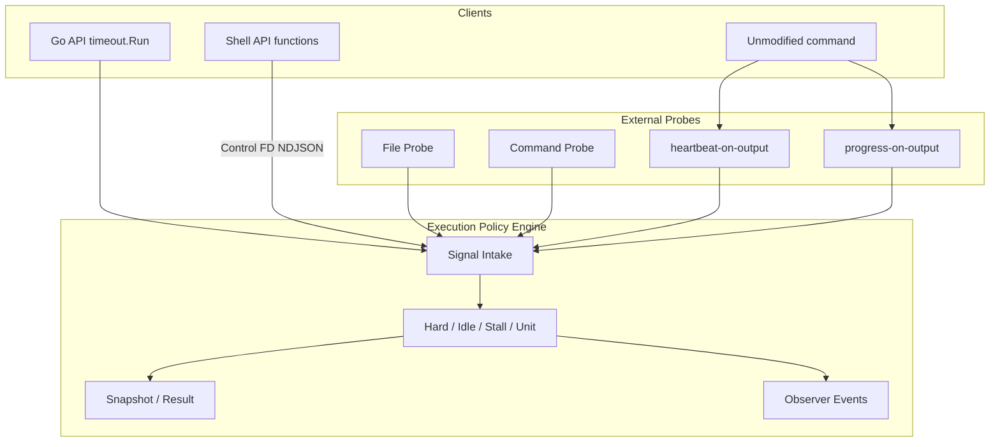

# 000 Timeoutx Execution Policy Engine (v0.3)

## 背景 (Background)

従来の `timeout` は「開始から一定時間が経過したか」だけを判定する。しかし実務の長時間実行では、次のような状態が区別できない。

- 実行全体が長すぎる
- プロセスは生きているが応答しない
- 応答はあるが仕事が前進していない
- 個別の処理単位だけが長すぎる
- 外部から観測できる成果物が変化しなくなった

`timeout` / `timeoutx` は、任意の長時間実行を複数の観点から監督する **Execution Policy Engine** として設計する。Go API、CLI、Shell API、外部 Probe はすべて同じ Policy Engine と Signal Model を使用する。

```text
Go function / Shell script / CLI / Worker / Coding Agent
                         │
                         ▼
              Execution Policy Engine
                         │
        Hard / Idle / Stall / Unit / Probe
```

### 命名

| 対象 | 名前 | 理由 |
|---|---|---|
| GitHub repository | `timeout` | プロジェクトの中心概念を簡潔に表す |
| Go package | `timeout` | `timeout.Run`、`timeout.Progress` と自然に読める |
| CLI executable | `timeoutx` | GNU `timeout` との command 名衝突を避ける |

推奨 GitHub Description:

> Detect long-running jobs that are alive but no longer making progress. A Go library and CLI with hard, idle, stall, and per-step timeouts for Go and shell scripts.

### v0.3 の目的

1. 実行時間だけでなく、応答性と実質的な進捗を別々に監視する。
2. Timeout 時に「どの処理で、どの程度進んだ状態で止まったか」を説明できるようにする。
3. Go、Shell、既存コマンドに同じ監視モデルを提供する。
4. ライブラリ利用と CLI 利用で、判定結果と終了処理を一致させる。
5. Agent や Worker の実行監督にも使える、汎用的な Execution primitive にする。

### 非目的 (v0.3)

次を Core の責務にしない。

- 分散ジョブキュー
- ジョブの再実行スケジューリング
- 永続的な Workflow 管理
- Progress からの高精度な残時間予測
- 複数 Execution を束ねた全体進捗の自動計算
- cgroup やコンテナランタイム固有の強制終了

### 中心的な考え方

次の三つを混同しない。

```text
Heartbeat  = 生きている
Status     = 今の状態を伝える
Progress   = 実際に前進した
```

---

## 要件 (Requirements)

### 必須要件

#### R1. 基本概念

| 概念 | 定義 |
|---|---|
| Execution | 監視対象となる一回の実行。開始時刻、各種 Signal、実行中の Unit、最新 Progress、終了結果を保持する |
| Policy | Execution を異常と判断する条件。v0.3 では Hard / Idle / Stall / Unit を標準とする |
| Signal | 監視対象から Policy Engine へ送られる観測情報 |
| Unit | Execution 内の名前付き処理区間。開始から終了までの経過時間を独立監視する |

#### R2. Signal と Idle / Stall 更新

| Signal | 意味 | Idle 更新 | Stall 更新 |
|---|---|---:|---:|
| `Heartbeat` | 実行主体が応答可能である | Yes | No |
| `Status` | 現在の状態・待機理由が変わった | Yes | No |
| 定性的 `Progress` | 意味のある仕事が完了・前進した | Yes | Yes |
| 定量的 `Progress`（値が増加） | 作業量が実際に増えた | Yes | Yes |
| 定量的 `Progress`（同値・後退） | 応答はあるが作業量は増えていない | Yes | No |

#### R3. Timeout Policy

##### R3.1 Hard Timeout

- Execution 開始からの総経過時間上限: `deadline = execution.started_at + hard_limit`
- Heartbeat や Progress では延長されない
- 用途例: ジョブ全体を 24 時間以内に終了、CI ステップの絶対上限

##### R3.2 Idle Timeout

- 最後の Activity からの経過時間上限: `idle_elapsed = now - last_activity_at`
- Activity は `Heartbeat` / `Status` / `Progress` の受信を指す
- 「実行主体が応答しているか」を監視する。仕事の前進は判定しない

##### R3.3 Stall Timeout

- 最後に確認された実質的 Progress からの経過時間上限: `stall_elapsed = now - last_progress_at`
- Heartbeat と Status では更新されない
- 定量 Progress では、原則として値が前回より増えた場合だけ更新される
- 「応答はあるが同じ場所で止まり続ける」状態を検出する

##### R3.4 Unit Timeout

- 各 Unit の開始から終了までの経過時間上限: `unit_elapsed = now - unit.started_at`
- Unit 内の Heartbeat や Progress では延長されない（Unit ごとの Hard Timeout）
- 複数 Unit が同時実行される場合、それぞれを独立監視し、いずれか一つが上限超過で Execution を Timeout とする

##### R3.5 無効化と優先順位

- Duration が `0` の場合、その Policy を無効とする
- 負の Duration は設定エラーとする
- 同一監視 Tick で複数 Policy が成立した場合の優先順位: **Hard > Unit > Stall > Idle**
- 内部判定には wall clock ではなく monotonic clock を使用する

#### R4. Go API

##### R4.1 基本型

```go
package timeout

type Policy struct {
    Hard  time.Duration
    Idle  time.Duration
    Stall time.Duration
    Unit  time.Duration

    KillAfter time.Duration
}

type Progress struct {
    Stage string

    Current int64
    Total   int64

    Message string
    Details any
}

type Execution interface {
    Context() context.Context

    Heartbeat()
    Status(message string)

    Progress(progress Progress)
    ProgressTo(current, total int64)

    BeginUnit(name string) Unit
    Unit(name string, fn func(context.Context) error) error

    Snapshot() Snapshot
}

type Unit interface {
    ID() uint64
    Name() string
    End()
}
```

- `Progress(Progress)` が正規 API
- `ProgressTo(current, total)` は数値だけを渡す糖衣構文。Message / Stage / Details 等の引数は追加しない

##### R4.2 実行 API

正規の実行 API は、**設定（Config）を関数本体より前に置く**形とする。
関数本体が大きくなっても、Timeout 設定が末尾に埋もれないようにするためである。

```go
type Func func(Execution) error

// Config は不変な実行設定である。各 Run は新しい Execution を生成する。
type Config struct { /* 非公開フィールド、または Policy 等 */ }

func New(options ...Option) Config

func Run(ctx context.Context, cfg Config, fn Func) Result

func (c Config) Run(ctx context.Context, fn Func) Result
```

原則は次のように分ける。

| 対象 | 表現 |
|---|---|
| 実行前の設定 | `New` への Functional Options → 不変な `Config` |
| 実行の開始 | `Run(ctx, cfg, fn)` または `cfg.Run(ctx, fn)` |
| 実行中の状態・Event | Struct value（`Progress` 等） |

```go
// 正規形: 設定が fn より前に来る
result := timeout.Run(ctx,
    timeout.New(
        timeout.Hard(24*time.Hour),
        timeout.Idle(30*time.Second),
        timeout.Stall(2*time.Minute),
        timeout.UnitLimit(1*time.Minute),
    ),
    func(exec timeout.Execution) error {
        // work
        return nil
    },
)

// 再利用: Config を保持して複数回 Run する
cfg := timeout.New(
    timeout.Hard(24*time.Hour),
    timeout.Idle(30*time.Second),
)
r1 := timeout.Run(ctx, cfg, jobA)
r2 := cfg.Run(ctx, jobB)
```

- `Config` は並行して複数の `Run` を呼び出してよい。実行状態は Run ごとに分離する
- 時間 Policy をすべて無効にする場合も、`timeout.New()` を明示的に渡す（nil Config は許可しない）
- `Run(ctx, fn, options...)` のように Option を fn の後ろに置く形は採用しない
##### R4.3 Context

`Execution.Context()` は次の場合に cancel される。

- いずれかの Timeout Policy が成立した
- 親 Context が cancel された
- Policy Engine 内部で継続不能なエラーが発生した

監視対象は可能な限りこの Context を下位処理へ伝播させる。

#### R5. Progress 仕様

##### R5.1 Progress は現在状態を伴う Event

```text
Log              過去に何が起きたかという履歴
Progress Message 現在どこまで進み、何をしているかという状態
```

最新値は Snapshot と Result へ保存され、Timeout 診断に使用される。

##### R5.2 フィールド

| フィールド | 用途 |
|---|---|
| `Current` / `Total` | work units としての定量進捗 |
| `Stage` | 機械可読な処理フェーズ識別子（表示文言には使わない。例: `import-users`） |
| `Message` | 人間向けの現在状態（ローカライズや状況に応じて変更可） |
| `Details` | 任意の構造化メタデータ |

##### R5.3 定性的 Progress

`Total <= 0` の場合は定性的 Progress。Idle と Stall の両方を更新する。

```go
exec.Progress(timeout.Progress{
    Stage:   "resolve-dependencies",
    Message: "依存関係の解決が完了しました",
})
```

##### R5.4 定量的 Progress

`Total > 0` の場合は `Current / Total` の定量 Progress。

```text
ratio   = current / total
percent = ratio * 100
```

これは work units としての進捗率であり、経過時間や残り時間の割合を保証しない。

##### R5.5 Stall 更新判定

同一系列は v0.3 では `Stage` と `Total` の組で識別する。

| 変化 | Idle | Stall | 解釈 |
|---|---:|---:|---|
| 最初の定量 Progress | 更新 | 更新 | 新しい進捗系列 |
| 同一 Stage/Total で Current 増加 | 更新 | 更新 | 実質的前進 |
| 同一 Stage/Total で Current 同値 | 更新 | 更新しない | 応答のみ |
| 同一 Stage/Total で Current 減少 | 更新 | 更新しない | 後退・再試行 |
| Stage 変更 | 更新 | 更新 | 新しい処理フェーズ |
| Total 変更 | 更新 | 更新 | v0.3 では新しい進捗系列 |

例: `3/10 → 3/10 → 3/10` は Activity だが Progress ではないため、Idle は解除できるが Stall は解除できない。

##### R5.6 値の制約

```text
Total > 0
Current >= 0
```

`Current > Total` は許容し、Percent は 100 を超えてよい。表示側が clamp してもよいが、Snapshot の生値は保持する。

##### R5.7 Status との違い

実質的な前進を意味しない場合は `Status` を使用する。Status は最新状態を更新し Idle を reset するが Stall は reset しない。同じ Status の繰り返しでは Stall を回避できない。

##### R5.8 将来拡張（v0.3 対象外）

- Epoch による replan の明示
- Weighted Progress
- 階層 Progress
- Rate の平滑化
- ETA 推定

#### R6. Unit 仕様

- 同期 Unit: `exec.Unit(name, fn)`（`BeginUnit` + `End` の shortcut）
- 手動 Unit: `BeginUnit` + `defer End()`
- 並行 Unit: 複数同時存在可。各 Unit は一意な ID を持ち、同名も許可
- `End` は冪等（終了済みへの 2 回目以降は何もしない）
- Unit Timeout 成立時、Result には少なくとも Unit ID / 名 / 開始時刻 / 経過時間 / 適用上限を記録する

#### R7. Snapshot と Result

##### R7.1 Snapshot

```go
type Snapshot struct {
    State State

    StartedAt time.Time
    Elapsed   time.Duration

    LastActivityAt time.Time
    IdleFor        time.Duration

    LastProgressAt time.Time
    StallFor       time.Duration

    Status   string
    Progress ProgressSnapshot
    Units    []UnitSnapshot
}

type ProgressSnapshot struct {
    Stage string

    Current int64
    Total   int64
    Ratio   float64
    Percent float64

    Message string
    Details any

    UpdatedAt time.Time
}
```

- Snapshot 取得は thread-safe で、呼び出し時点の一貫した状態を返す
- `Details` の deep copy は保証しない。呼び出し側は送信後に変更しない値、または immutable な値を使う

##### R7.2 Result

```go
type Result struct {
    Status ResultStatus
    Kind   TimeoutKind

    Err      error
    Snapshot Snapshot

    StartedAt  time.Time
    FinishedAt time.Time
    Elapsed    time.Duration
}
```

`ResultStatus` は少なくとも次を持つ: `succeeded` / `failed` / `timeout` / `canceled` / `internal_error`

`TimeoutKind` は次を持つ: `none` / `hard` / `idle` / `stall` / `unit` / `probe`

#### R8. Observer と Event

```go
type Event struct {
    Type      EventType
    Timestamp time.Time
    Snapshot  Snapshot
}
```

標準 Event（想定）:

- execution started
- heartbeat received
- status changed
- progress received
- meaningful progress confirmed
- unit started
- unit ended
- timeout detected
- termination requested
- execution finished

Observer の遅延で監視ループを止めてはならない。同期 Observer を提供する場合でも、実装は実行時間を明確に制限する。

#### R9. CLI 仕様

##### R9.1 基本形

```bash
timeoutx run \
  --hard 24h \
  --idle 30s \
  --stall 5m \
  --unit 1m \
  --kill-after 10s \
  -- ./job.sh
```

##### R9.2 主要オプション

| Option | 意味 |
|---|---|
| `--hard DURATION` | Execution 全体の上限 |
| `--idle DURATION` | Activity がない時間の上限 |
| `--stall DURATION` | 実質的 Progress がない時間の上限 |
| `--unit DURATION` | 各 Unit の経過時間上限 |
| `--kill-after DURATION` | TERM 後に KILL へ移行する猶予 |
| `--result PATH` | 最終結果を JSON で保存 |
| `--show-progress` | TTY へ進捗表示 |
| `--progress-format json` | machine-readable な Event を出力 |
| `-c, --config PATH` | YAML 設定を読み込む |

Duration は Go duration 形式（例: `500ms`、`30s`、`5m`、`24h`）。

##### R9.3 標準入出力

- 子プロセスの stdout/stderr はデフォルトで透過する
- `timeoutx` 自身の診断は stderr へ出力する
- JSON Event は指定された Event 出力先へ newline-delimited JSON で書き込む
- 制御 Protocol はユーザーの stdout/stderr とは別の inherited FD を使用する

#### R10. Shell API

##### R10.1 初期化

```bash
eval "$(timeoutx shell-init)"
```

`shell-init` は親 CLI から渡された Control FD を使用する Shell 関数を定義する。

##### R10.2 API

```bash
timeout_heartbeat

timeout_status "外部APIの応答を待っています"

timeout_progress "依存関係の解決が完了しました"

timeout_progress \
  --current 3 \
  --total 10 \
  --stage import-users \
  "ユーザーデータをインポートしています"

timeout_unit NAME COMMAND...

id=$(timeout_unit_begin "database-import")
# work
timeout_unit_end "$id"
```

Shell library は Policy Engine を実装しない。Go CLI へ Signal を送る薄い adapter とする。

#### R11. Control Protocol

##### R11.1 Transport

```text
TIMEOUTX_FD=<fd-number>
TIMEOUTX_PROTOCOL=1
```

Protocol は一行一 Message の NDJSON。

##### R11.2 Message

Heartbeat:

```json
{"v":1,"type":"heartbeat"}
```

Status:

```json
{"v":1,"type":"status","message":"外部APIの応答を待っています"}
```

定性的 Progress:

```json
{"v":1,"type":"progress","stage":"resolve-dependencies","message":"依存関係の解決が完了しました"}
```

定量的 Progress:

```json
{"v":1,"type":"progress","stage":"import-users","current":3,"total":10,"message":"ユーザーデータをインポートしています","details":{"file":"users-003.csv"}}
```

Unit:

```json
{"v":1,"type":"unit_begin","id":17,"name":"download"}
{"v":1,"type":"unit_end","id":17}
```

##### R11.3 Protocol エラー

- 不正な JSON、一行の上限超過、未知の必須 Version は Protocol 診断として記録する
- 単発の不正 Message だけで Execution を直ちに停止するかは Policy で選択可能
- デフォルトは不正 Message を無視し、stderr と Result へ診断を残す
- Control FD の EOF は子プロセス終了までは Signal 停止を意味し、それ自体を Timeout とはしない

#### R12. 無改造コマンドの外形監視

##### R12.1 出力監視

- `--heartbeat-on-output`: stdout/stderr への出力を Heartbeat として扱う
- 出力はデフォルトでは Progress として扱わない（エラー無限出力の誤認防止）
- `--progress-on-output` を明示した場合のみ、出力を Progress として扱う

##### R12.2 File Probe

```bash
timeoutx run \
  --stall 1m \
  --progress-file ./output.tar \
  -- ./backup.sh
```

少なくとも file size と modification time を監視する。値が変化した場合に Progress として扱う。ファイル未存在はデフォルトで「Progress なし」。

##### R12.3 Command Probe

```bash
timeoutx run \
  --stall 30s \
  --probe-every 5s \
  --probe './check-progress.sh' \
  -- ./worker.sh
```

YAML での複雑な Probe 定義を許可する。

```yaml
hard: 6h
idle: 30s
stall: 2m

probes:
  - type: file
    path: output.tar
    interval: 5s
    signal: progress

  - type: command
    command: ./health.sh
    interval: 10s
    signal: heartbeat
```

Command Probe の詳細な stdout protocol は実装時に固定する。Probe 失敗と監視対象失敗は Result 上で区別する。

#### R13. Timeout 時の終了処理

##### R13.1 Unix 系 CLI 標準シーケンス

1. Timeout を確定し Result Snapshot を取得する
2. 子 process group へ `SIGTERM` を送る
3. `--kill-after` の猶予を待つ
4. 生存している process group へ `SIGKILL` を送る
5. 最終 Result を出力する

子 PID だけでなく process group を対象にする（孫プロセス残留防止）。

##### R13.2 ライブラリ利用

- Go ライブラリは Context cancellation を行う
- OS process の TERM/KILL は process runner 利用時のみライブラリが管理する
- 任意の goroutine を強制終了する機能は提供しない

##### R13.3 Caller Cancellation

親 Context の cancel は `canceled` とし、Timeout とは区別する。CLI が外部 Signal を受けた場合は、可能な限り元 Signal に沿って終了処理と exit code を決定する。

#### R14. Exit Code

GNU `timeout` との親和性を優先する。

| Code | 意味 |
|---:|---|
| `0..123` | 子 command の終了結果 |
| `124` | timeoutx Policy 超過 |
| `125` | timeoutx 内部エラー |
| `126` | command を実行できない |
| `127` | command が見つからない |
| `137` | SIGKILL で終了 |

Hard / Idle / Stall / Unit の区別は exit code を細分化せず、stderr および Result JSON へ記録する。

`SIGKILL` が timeoutx の二段階終了処理による場合、v0.3 デフォルトは GNU `timeout` に合わせて `124` とする（Signal 忠実モードで `137` を選べる余地はある）。

#### R15. Result JSON

`--result PATH` で最終結果を JSON 保存する。例:

```json
{
  "status": "timeout",
  "kind": "stall",
  "elapsed": "43m12s",
  "idle": "3s",
  "stall": "2m0s",
  "statusMessage": "画像を変換しています",
  "progress": {
    "stage": "convert-images",
    "current": 37,
    "total": 100,
    "percent": 37,
    "message": "画像 037.jpg を変換しています",
    "updatedAt": "2026-09-21T00:00:00Z"
  },
  "timeout": {
    "limit": "2m",
    "detectedAt": "2026-09-21T00:02:00Z"
  }
}
```

人向け stderr 例:

```text
timeoutx: STALL timeout: no meaningful progress for 2m0s
timeoutx: progress: 37 / 100 (37%)
timeoutx: last activity: "画像 037.jpg を変換しています"
```

#### R16. Progress 表示

TTY では次のような表示を許可する。

```text
[######--------------] 30%  import-users
ユーザーデータをインポートしています
```

非 TTY では ANSI 制御文字を使用しない。`--progress-format json` の例:

```json
{"type":"progress","stage":"import-users","current":7,"total":10,"percent":70,"message":"ユーザーデータをインポートしています"}
```

ETA は v0.3 Core の保証対象外。UI が参考値として表示する場合は推定値であることを明示する。

#### R17. Concurrency と安全性

- `Heartbeat` / `Status` / `Progress` / `BeginUnit` / `End` / `Snapshot` は複数 goroutine から呼び出せる
- Signal の時刻は Policy Engine が受信した時点を基準とする
- Timeout 確定は一度だけ行い、以後の Signal で結果を覆さない
- Timeout と正常終了が競合した場合、先に Engine へ commit された状態を採用する
- Observer や出力処理が監視 timer を長時間 block してはならない
- Result ファイルは可能な限り一時ファイルへ書いた後、atomic rename する

#### R18. デフォルト

時間 Policy はデフォルトですべて無効。利用者は少なくとも一つを明示する。

| 項目 | デフォルト |
|---|---|
| Hard / Idle / Stall / Unit | disabled |
| Kill signal | SIGTERM |
| Kill after | 10s |
| Kill target | process group |
| Output interpretation | none |
| Progress display | TTY 時のみ auto、または明示指定 |
| Protocol error | warn and ignore |

すべての時間 Policy が無効な場合、CLI は警告を表示してもよいが、command 実行自体は許可する。

### 任意要件

- YAML 設定ファイルによる Policy / Probe 定義
- TTY 向け進捗バー表示
- Signal 忠実モード（KILL 時 exit code `137`）

---

## 実現方針 (Implementation Approach)

### パッケージ構成

```text
timeout/
├── policy.go
├── execution.go
├── signal.go
├── progress.go
├── monitor.go
├── result.go
├── probe.go
├── unit.go
├── observer.go
├── process/
│   ├── runner.go
│   └── terminate_unix.go
├── protocol/
│   └── v1.go
├── cmd/
│   └── timeoutx/
└── shell/
    ├── bash
    └── sh
```

Go API、CLI、Shell は別々の Timeout 実装を持たず、同じ Execution Policy Engine へ接続する。

### 設計上の確定事項 (v0.3)

- 実行 API の正規形は `Run(ctx, Config, Func)` とし、設定を関数本体より前に置く
- Functional Options は `New(...Option) Config` に閉じ、`Run` の可変長引数としては受け取らない
- `Config` は不変で再利用可能。各 `Run` が新しい Execution を生成する
- `Config.Run(ctx, Func)` は `Run(ctx, cfg, Func)` と同等の shortcut とする
- Progress の正規 API は Functional Options ではなく `Progress` value object を渡す形式とする
- `ProgressTo(current, total)` は数値だけを渡す小さな shortcut とする
- `Stage` / `Message` / `Details` が必要な場合は正規 API を使う
- Heartbeat / Status / Progress は異なる意味を持つ Signal として扱う
- 定量 Progress の同値再送は Activity だが、意味のある Progress ではない
- Progress Message はログではなく、最新の実行状態として Snapshot に保持する
- CLI / Shell 連携には stdout/stderr ではなく inherited FD を使用する
- Shell 実装は Signal Adapter に限定し、監視ロジックは Go 側へ集約する
- Timeout 種別は exit code ではなく、Result と診断出力で表現する

### アーキテクチャ概要



### 未確定事項（実装開始前または v0.3 開発中に決定）

1. Command Probe の厳密な exit/output protocol
2. JSON Event の既定出力先と専用 FD の CLI 指定方法
3. Protocol 一行あたりの最大サイズ
4. Observer の backpressure / drop policy
5. Windows における process tree 終了方式
6. Result JSON Schema の正式公開方法
7. `Details` の JSON 変換に失敗した場合の扱い
8. 子 command が 124 を返した場合と timeoutx 自身の 124 を識別する互換オプション

---

## 検証シナリオ (Verification Scenarios)

v0.3 受け入れ条件を、時系列の検証イメージとして転記・整理する。

### VS1. Policy 独立判定

1. Hard / Idle / Stall / Unit をそれぞれ単独で有効にした Execution を起動する
2. 各 Policy の条件だけを満たす操作（または時間経過）を行う
3. 成立した TimeoutKind が期待どおり（hard / idle / stall / unit）であることを確認する
4. 同一 Tick で複数条件が成立するケースでは、優先順位 Hard > Unit > Stall > Idle で Kind が決まることを確認する

### VS2. Heartbeat では Stall を回避できない

1. Stall Timeout を有効にした Execution を開始する
2. Heartbeat だけを継続的に送る（Progress は送らない）
3. Stall 上限経過後に Timeout となり、Kind が `stall` であることを確認する

### VS3. 同値定量 Progress では Stall を回避できない

1. Stall Timeout を有効にした Execution を開始する
2. 最初に定量 Progress `3/10` を送る
3. その後、同じ `Stage` / `Total` で `Current=3` を繰り返し送る
4. Idle は更新されるが Stall は更新されず、Stall 上限経過後に Timeout（Kind=`stall`）となることを確認する

### VS4. Progress 増加で Idle と Stall がともに reset される

1. Idle / Stall の両方を有効にする
2. 定量 Progress で Current を増加させる
3. `last_activity_at` と `last_progress_at` の両方が更新されることを Snapshot で確認する

### VS5. Status は Idle だけを reset する

1. Idle / Stall の両方を有効にする
2. Status を更新する
3. Idle だけが reset され、Stall は reset されないことを確認する
4. 同じ Status を繰り返しても Stall を回避できないことを確認する

### VS6. Timeout Result の診断情報

1. 各種 Timeout を発生させる
2. Result から次を取得できることを確認する
   - Kind
   - 経過時間
   - 最新 Status
   - 最新 Progress
   - 該当 Unit（Unit Timeout の場合）

### VS7. Go API と CLI の判定共有

1. 同じ Policy 条件・同じ Signal 列で Go API テストと CLI テストを実行する
2. TimeoutKind / Snapshot 上の進捗状態が一致することを確認する

### VS8. Shell から Control FD 経由で全 Signal を送信

1. `timeoutx run` 配下で `eval "$(timeoutx shell-init)"` したスクリプトを起動する
2. `timeout_heartbeat` / `timeout_status` / `timeout_progress` / `timeout_unit*` を実行する
3. Engine 側で対応する Signal が受信・反映されることを確認する

### VS9. process group の TERM → KILL

1. 子プロセスがさらに孫プロセスを起動するコマンドを `timeoutx run` で監視する
2. Timeout 成立後、process group へ SIGTERM が送られることを確認する
3. `--kill-after` 経過後も生存している場合、SIGKILL が送られることを確認する
4. 孫プロセスが残留しないことを確認する

### VS10. GNU `timeout` 親和の exit code

1. Policy 超過時に exit code `124` を返すことを確認する
2. 内部エラー時 `125`、実行不可 `126`、not found `127` を確認する
3. 子 command の通常終了コード `0..123` を透過することを確認する

### VS11. Race detector 下の並行安全性

1. 複数 goroutine から Heartbeat / Status / Progress / BeginUnit / End / Snapshot を並行呼び出しする
2. `go test -race` 下で成功することを確認する

### VS12. monotonic clock 差し替えによる決定的テスト

1. テスト用に monotonic clock を差し替える
2. 実時間を待たずに Hard / Idle / Stall / Unit の判定を決定的に再現できることを確認する

### VS13. Shell 利用例の端到端

1. 次のスクリプト相当を実行する

```bash
#!/usr/bin/env bash
eval "$(timeoutx shell-init)"

total=10
for i in $(seq 1 "$total"); do
    timeout_unit "import:$i" ./import "$i"

    timeout_progress \
      --current "$i" \
      --total "$total" \
      --stage import-users \
      "${i}件目のインポートが完了しました"
done
```

2. 各 Unit と定量 Progress が Engine に反映され、正常完了することを確認する

### VS14. 外形監視（出力 / File Probe）

1. `--heartbeat-on-output` 付きで出力するコマンドを監視し、出力が Heartbeat として Idle を更新することを確認する
2. デフォルトでは出力が Progress（Stall 更新）にならないことを確認する
3. `--progress-file` で監視対象ファイルの size / mtime 変化が Progress になることを確認する
4. ファイル未存在時はデフォルトで Progress なしであることを確認する

---

## テスト項目 (Testing for the Requirements)

### ビルド・全体検証

1. ビルド＋単体テスト:

```bash
scripts/process/build.sh
```

2. Policy Engine 単体のリグレッション（Hard / Idle / Stall / Unit、Signal 更新、優先順位、clock 差し替え）:

```bash
scripts/process/integration_test.sh --specify "TestPolicy|TestSignal|TestStall|TestIdle|TestUnit|TestHard|TestClock"
```

3. Go API と CLI の判定共有・Result 診断:

```bash
scripts/process/integration_test.sh --specify "TestGoAPI|TestCLI|TestResult|TestSnapshot"
```

4. Control Protocol / Shell API:

```bash
scripts/process/integration_test.sh --specify "TestProtocol|TestShell|TestControlFD"
```

5. 終了処理・exit code・process group:

```bash
scripts/process/integration_test.sh --specify "TestTerminate|TestExitCode|TestProcessGroup|TestKillAfter"
```

6. Race detector 付きの並行 Signal / Snapshot（単体テスト側で実施する想定）:

```bash
scripts/process/build.sh
# 実装時は go test -race を unit test スイートに含めること
```

7. Probe / 外形監視:

```bash
scripts/process/integration_test.sh --specify "TestProbe|TestHeartbeatOnOutput|TestProgressFile"
```

### 要件と検証の対応

| 要件 | 主な検証シナリオ | 自動化手段 |
|---|---|---|
| R3 Policy 判定 | VS1, VS12 | `build.sh` + integration `--specify "TestPolicy\|TestHard\|..."` |
| R2/R5 Signal・Progress | VS2–VS5 | `--specify "TestSignal\|TestStall\|TestIdle"` |
| R6/R7 Unit・Result | VS6 | `--specify "TestResult\|TestUnit\|TestSnapshot"` |
| R4/R9 Go・CLI 一致 | VS7 | `--specify "TestGoAPI\|TestCLI"` |
| R10/R11 Shell・Protocol | VS8, VS13 | `--specify "TestProtocol\|TestShell"` |
| R13/R14 終了・exit code | VS9, VS10 | `--specify "TestTerminate\|TestExitCode"` |
| R17 並行安全性 | VS11 | `go test -race`（build/unit） |
| R12 Probe | VS14 | `--specify "TestProbe\|TestHeartbeatOnOutput\|TestProgressFile"` |

---

## 付録: 受け入れ条件チェックリスト (v0.3)

- [ ] Hard、Idle、Stall、Unit を独立に判定できる
- [ ] Heartbeat を送り続けても Stall Timeout を回避できない
- [ ] 同じ定量 Progress を送り続けても Stall Timeout を回避できない
- [ ] Progress 値の増加で Idle と Stall の両方が reset される
- [ ] Status 更新は Idle だけを reset する
- [ ] Timeout 結果から kind、経過時間、最新 Status、最新 Progress、該当 Unit を取得できる
- [ ] Go API と CLI で同じ判定テストを共有できる
- [ ] Shell から Control FD 経由で全 Signal を送信できる
- [ ] CLI が process group を TERM→KILL の順で終了できる
- [ ] GNU `timeout` と親和性のある exit code を返せる
- [ ] Race detector 下で並行 Signal と Snapshot のテストが成功する
- [ ] monotonic clock を差し替え、時間を待たずに決定的なテストができる
