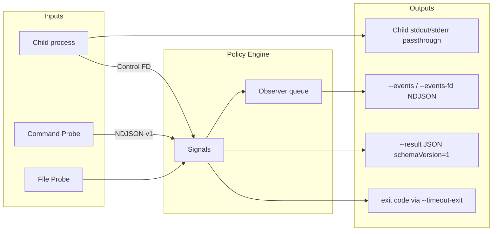

# 001 Timeoutx Open Items Resolution (v0.3)

> **Parent Specification**: `prompts/phases/000-foundation/branches/main/ideas/000-Timeoutx-Execution-Policy-Engine.md`
>
> 本仕様は親仕様「未確定事項」8 項目を確定し、実装可能な要件へ落とし込む。
> 確定後、親仕様の未確定リストは本仕様への参照に置き換えてよい。

## 背景 (Background)

v0.3 のコア Policy Engine、CLI、Shell、File Probe、Release は実装済みである。
一方、親仕様に残っていた次の 8 項目は、実装者が仮決めするか未実装のままになっていた。

1. Command Probe の厳密な exit/output protocol
2. JSON Event の既定出力先と専用 FD の CLI 指定方法
3. Protocol 一行あたりの最大サイズ
4. Observer の backpressure / drop policy
5. Windows における process tree 終了方式
6. Result JSON Schema の正式公開方法
7. `Details` の JSON 変換に失敗した場合の扱い
8. 子 command が 124 を返した場合と timeoutx 自身の 124 を識別する互換オプション

これらを曖昧なままにすると、ライブラリ利用者・CLI 利用者・外部 Probe 作者の間で挙動が分岐する。
本仕様で v0.3 の確定事項として固定する。

---

## 要件 (Requirements)

### 必須要件

#### R1. Command Probe Protocol（未確定 #1）

Command Probe は一定間隔で外部コマンドを実行し、その結果を Signal に変換する。

##### R1.1 起動

```bash
timeoutx run \
  --stall 30s \
  --probe-every 5s \
  --probe './check-progress.sh' \
  -- ./worker.sh
```

YAML:

```yaml
probes:
  - type: command
    command: ./check-progress.sh
    interval: 5s
    # signal は stdout protocol が優先。失敗時のフォールバックのみ指定可
    on_failure: ignore   # ignore | warn | fail-probe
```

- `--probe` / YAML `command` はシェル経由ではなく、引数分割した直接 exec を基本とする（空白を含む場合は配列形式を YAML で推奨）。
- `interval` / `--probe-every` のデフォルトは `5s`。`0` 以下は設定エラー。

##### R1.2 stdout Protocol（確定）

Probe の **stdout は一行一 Message の NDJSON** とする。Control Protocol v1 と同じ envelope 形を再利用する。

許可する `type`:

| type | 効果 |
|---|---|
| `heartbeat` | Idle 更新 |
| `status` | Status 更新 + Idle 更新 |
| `progress` | Progress（定性/定量）+ Idle/Stall 規則は親仕様どおり |

例:

```json
{"v":1,"type":"heartbeat"}
{"v":1,"type":"status","message":"queue depth 3"}
{"v":1,"type":"progress","stage":"convert","current":10,"total":100,"message":"converting"}
```

規則:

1. Probe は **終了コード 0** かつ、stdout に 0 行以上の有効 Message を書いてよい。
2. 1 回の Probe 実行で複数行あってよい。上から順に適用する。
3. stderr は timeoutx の診断 stderr へプレフィックス付きで転送してよい（デフォルト: 非 TTY では破棄、または `--probe-verbose` で表示）。
4. stdout が空で exit 0 の場合:
   - YAML/`--probe-signal` で `heartbeat` または `progress` を指定していればその Signal を 1 回送る。
   - 未指定なら **何も送らない**（成功だが観測なし）。
5. exit code ≠ 0 は Probe 失敗（監視対象の失敗ではない）。

##### R1.3 Probe 失敗と監視対象失敗の区別

| 状況 | Execution 結果 | Result フィールド |
|---|---|---|
| 監視対象が Policy 超過 | `status=timeout`, `kind=hard\|idle\|stall\|unit` | 通常どおり |
| Probe コマンド起動失敗 / 非 0 終了 / 不正 NDJSON | Execution は継続（デフォルト） | `probes[].lastError` に記録 |
| `on_failure: fail-probe` かつ Probe 失敗 | `status=failed`, `kind=probe` | `Err` に Probe エラー |

デフォルト `on_failure` は `warn`（stderr に警告 + Result 診断、Execution 継続）。

##### R1.4 同時実行

同じ Probe の前回実行が interval 内に終わらない場合、**次の起動をスキップ**し、診断に `probe_skipped_overlap` を残す。並列多重起動しない。

#### R2. JSON Event 出力先（未確定 #2）

##### R2.1 原則

- 子プロセスの stdout/stderr は透過する（親仕様どおり）。
- timeoutx の machine-readable Event は **子の stdout/stderr と混線させない**。
- Event 出力は **オプトイン**。指定がなければ Event ストリームは出さない（人間向け診断は従来どおり stderr）。

##### R2.2 CLI フラグ（確定）

| Flag | 意味 |
|---|---|
| `--events PATH` | NDJSON Event をファイルへ書く。`PATH` が `-` のときは **timeoutx の stderr** |
| `--events-fd N` | 親から継承した FD `N` へ NDJSON Event を書く |
| `--progress-format json` | TTY 進捗の代わりに progress 系 Event を出す。出力先は `--events` / `--events-fd` が無ければ **stderr** |

優先順位:

1. `--events-fd` が指定されていればそれを使う
2. 否则 `--events` を使う
3. 否则 `--progress-format json` のみなら stderr
4. どれも無ければ Event ストリームなし

`--events` と `--events-fd` の同時指定は設定エラー（exit 125）。

##### R2.3 Event 行フォーマット

Control Protocol とは別の **Event NDJSON** とする。

```json
{"v":1,"type":"progress","ts":"2026-09-21T00:00:00Z","stage":"import-users","current":7,"total":10,"percent":70,"message":"..."}
{"v":1,"type":"timeout","ts":"...","kind":"stall","elapsed":"2m0s"}
{"v":1,"type":"finished","ts":"...","status":"timeout","kind":"stall"}
```

`type` は Observer EventType に対応する（snake_case）。未知フィールドは読者側が無視できるよう追加してよい。

#### R3. Protocol 一行最大サイズ（未確定 #3）

| 項目 | 確定値 |
|---|---|
| デフォルト上限 | **1 MiB**（`1048576` bytes）= `protocol.MaxLineBytes` |
| 超過時 | その行を Protocol エラーとして扱い、デフォルトは warn + ignore（親仕様どおり） |
| 上書き | 環境変数 `TIMEOUTX_MAX_LINE_BYTES`（正の整数、バイト）。不正値は起動時エラー |
| 下限 | 実装は最低 `4096` を受け付ける。それ未満は設定エラー |

CLI に `--max-line-bytes` を追加してもよいが、v0.3 では環境変数で十分とする（任意）。

#### R4. Observer backpressure / drop policy（未確定 #4）

##### R4.1 デフォルト（確定）

- Observer 配信は **非同期**（監視ループを block しない）。
- バッファ容量のデフォルトは **64 Event**。
- バッファ満杯時は **新しい Event を drop**（drop-newest）。古い Event は残す。
- drop 発生時は内部カウンタ `events_dropped` を加算する。
- `Result` / Snapshot 診断、または最終 Event `finished` に `eventsDropped` を含めてよい。

##### R4.2 設定 API

```go
timeout.WithObserver(obs)
timeout.WithObserverQueue(size int)           // size <= 0 はデフォルト 64
timeout.WithObserverDropPolicy(policy)       // DropNewest（デフォルト）| DropOldest
```

| Policy | 挙動 |
|---|---|
| `DropNewest` | 満杯なら新規を捨てる（デフォルト） |
| `DropOldest` | 満杯なら最古を捨てて新規を入れる |

同期 Observer（呼び出し元 goroutine で直接 `OnEvent`）は提供しない。
必要なら利用者が自分の Observer 内で同期処理する（その遅延は配信 goroutine に閉じ、monitor には影響しない）。

#### R5. Windows process tree 終了（未確定 #5）

##### R5.1 確定方式

Windows では **Job Object** を使う。

1. 子プロセス起動時に Job Object を作成し、子を Assign する。
2. `CREATE_BREAKAWAY_FROM_JOB` を付けない限り、孫プロセスも同一 Job に入る（デフォルトの CreateProcess 連鎖）。
3. Timeout 時:
   1. Result Snapshot を確定
   2. Job に対して graceful 停止を試行（プロセス列挙して CTRL_BREAK / terminate をベストエフォート）
   3. `--kill-after` 経過後、`TerminateJobObject` で Job 全体を強制終了
4. Job Handle は Runner 終了時に閉じる。

##### R5.2 制約

- Job Object が使えない環境（権限・ネスト制限）では、現行の「子 PID への直接 Kill」へフォールバックし、stderr に警告を出す。
- Unix の process group（`Setpgid` + `kill(-pgid, ...)`）は変更しない。

#### R6. Result JSON Schema の公開（未確定 #6）

##### R6.1 配置（確定）

| ファイル | 役割 |
|---|---|
| `docs/schemas/result.schema.json` | Result JSON の JSON Schema（Draft 2020-12） |
| `docs/schemas/event.schema.json` | Event NDJSON 1 行の Schema（任意だが推奨） |

- Schema はリポジトリにコミットし、GitHub 上で閲覧可能とする。
- Go の `embed` で CLI が `--result-schema` を stdout に出力できるようにしてよい（任意）。

##### R6.2 Result JSON に必須の版フィールド

```json
{
  "schemaVersion": 1,
  "status": "timeout",
  "kind": "stall",
  ...
}
```

- `schemaVersion` は整数。v0.3 は **`1`**。
- 後方互換のない変更時のみ増加する。
- 既存フィールドの意味を変える場合は major（+1）。フィールド追加のみなら version 維持可。

#### R7. Details の JSON 変換失敗（未確定 #7）

##### R7.1 適用箇所

- Control Protocol / Event / Result JSON へ `Details` を書くとき
- Probe / Progress 受信時に `Details` を保持するとき

##### R7.2 確定方針

| 段階 | 挙動 |
|---|---|
| Go API で `Progress.Details` に非 JSON シリアライズ可能値 | **実行は継続**。Snapshot の `Details` は Go 値のまま保持してよい |
| Result JSON / Event / Protocol へ書くとき変換失敗 | **その出力から `details` キーを省略**。Execution は失敗させない |
| 診断 | stderr または Event に `details_marshal_error` 警告を 1 回以上出してよい |
| Protocol 受信で `details` が不正 JSON | 親仕様どおり Protocol エラー（デフォルト warn + ignore）。Message 全体を捨てる |

`encoding/json` がエラーを返す型（chan、func、循環参照等）が対象。

#### R8. 子 exit 124 と timeoutx 124 の識別（未確定 #8）

##### R8.1 原則

- デフォルトは GNU `timeout` 互換のまま、Policy 超過は **exit 124**。
- 区別が必要な利用者向けに、timeoutx 側の Timeout exit code を変更できる。

##### R8.2 CLI（確定）

| Flag | デフォルト | 意味 |
|---|---|---|
| `--timeout-exit CODE` | `124` | Policy 超過時に timeoutx が出す exit code |
| `--signal-exit` | off | Timeout 後に SIGKILL した場合、GNU ではなく signal 忠実に `128+signal`（例: 137）を使う。`--timeout-exit` より優先 |

規則:

1. Policy 超過かつ `--signal-exit` オフ → `--timeout-exit` の値（デフォルト 124）。
2. Policy 超過かつ `--signal-exit` オンかつ最終的に SIGKILL → `137`（または実装が検出した signal）。
3. 子が自ら 124 で終了し、Policy 超過でない → **子の 124 を透過**。
4. 識別の正本は常に `--result` JSON の `status` / `kind`（および stderr 診断）。

```bash
# 子の 124 と衝突させたくない例
timeoutx run --timeout-exit 143 --stall 2m --result out.json -- ./job.sh
```

##### R8.3 Result JSON

```json
{
  "schemaVersion": 1,
  "status": "timeout",
  "kind": "stall",
  "exitCode": 143
}
```

`exitCode` は timeoutx がプロセス終了時に返すコードを記録する（任意追加だが v0.3 で推奨）。

### 任意要件

- `--max-line-bytes` CLI フラグ（環境変数の代替）
- `--result-schema` で schema を stdout 出力
- `--probe-verbose` で Probe stderr を常時表示
- YAML `-c/--config` での probes 一括定義（親仕様に既出。本仕様の Command Probe 規則に従う）

---

## 実現方針 (Implementation Approach)

### パッケージ影響

| 領域 | 変更 |
|---|---|
| `protocol/` | `MaxLineBytes` を環境変数で上書き可能に。定数デフォルト 1MiB を確定コメント化 |
| `probe.go`（新規または拡張） | Command Probe runner、NDJSON 適用、overlap skip |
| `process/` | Windows Job Object 終了、Event writer、timeout-exit マッピング |
| `observer.go` | queue size / DropNewest\|DropOldest、drop カウンタ |
| `cmd/timeoutx` | `--events`, `--events-fd`, `--probe`, `--probe-every`, `--timeout-exit`, `--signal-exit` |
| `docs/schemas/` | `result.schema.json`, `event.schema.json` |
| Result JSON | `schemaVersion`, 任意で `exitCode`, `eventsDropped`, `probes` 診断 |

### 設計上の確定事項（本仕様で新たに固定）

1. Command Probe の stdout は Control Protocol と同一の NDJSON v1 envelope を使う。
2. Event ストリームはオプトイン。子の stdout には混ぜない。
3. Protocol 行上限は 1MiB。超過は warn+ignore（デフォルト）。
4. Observer は非同期・バッファ 64・デフォルト DropNewest。
5. Windows 終了は Job Object。失敗時のみ PID Kill へフォールバック。
6. Result Schema は `docs/schemas/result.schema.json`。JSON に `schemaVersion: 1`。
7. Details の marshal 失敗は出力から省略し、Execution は継続。
8. Policy 超過 exit は `--timeout-exit`（デフォルト 124）。子の 124 は非 Timeout 時に透過。

### 親仕様との関係

- 本仕様は親仕様 R12 / R14 / R15 / R16 / R8 / 未確定リストを **上書き確定**する。
- 矛盾する場合は本仕様を優先する。
- 親仕様の「未確定事項」節は、実装完了後に本ファイルへのリンクへ更新する。



---

## 検証シナリオ (Verification Scenarios)

### VS1. Command Probe が Progress を送る

1. `--stall 2s --probe-every 200ms --probe` に、毎回 `{"v":1,"type":"progress","stage":"p","current":N,"total":10}` を書くスクリプトを渡す（N を増やす）。
2. 子は `sleep 5` など長時間待つ。
3. Stall で落ちず、正常終了または Hard 未設定なら子終了まで生き残る。
4. `--result` に最新 Progress が残る。

### VS2. Command Probe が Heartbeat のみでは Stall を回避できない

1. `--stall 1s --probe-every 100ms --probe` が毎回 heartbeat のみを返す。
2. 子は sleep のまま。
3. 約 1s で `status=timeout`, `kind=stall`, exit は `--timeout-exit` デフォルトなら 124。

### VS3. Probe 失敗はデフォルトで Execution を止めない

1. Probe が exit 1 を返す。
2. 子は短時間で成功終了する。
3. 全体の exit は 0（子成功）。Result に Probe エラー診断が残る。

### VS4. Event が子 stdout に混ざらない

1. 子が stdout に `HELLO` を書く。
2. `--events /tmp/events.ndjson --show-progress` または progress Event が出る状況にする。
3. 子の stdout キャプチャに Event JSON が混ざらず、`HELLO` のみ（または子出力のみ）である。
4. events ファイルに NDJSON が書かれている。

### VS5. `--events-fd` と `--events` の同時指定は 125

1. 両方を指定して起動する。
2. 子を実行せず exit 125。

### VS6. 行サイズ超過

1. Control FD または Probe から 1MiB+1 の行を送る。
2. Execution はデフォルトで継続する。
3. stderr / Result に protocol 診断が残る。

### VS7. Observer DropNewest

1. バッファサイズ 1 の Observer を付け、monitor より遅い Observer を登録する。
2. 大量の Heartbeat / Progress を送り、drop カウンタが増加する。
3. 監視ループがブロックされず、Hard/Idle 判定が時間どおりに動く。

### VS8. Windows Job Object（Windows 上）

1. 子がさらに孫プロセスを起動する。
2. Hard timeout 後、子も孫も残らない。
3. Job 作成に失敗するモック/制限環境では PID Kill フォールバックと警告が出る（可能な範囲で）。

### VS9. Result schemaVersion

1. `--result out.json` で Timeout させる。
2. `schemaVersion` が `1` である。
3. `docs/schemas/result.schema.json` に対して JSON が valid（テストでファイル存在と必須フィールドを確認）。

### VS10. Details marshal 失敗

1. Go API で `Details` に `make(chan int)` を渡して Progress する。
2. Execution は成功できる。
3. `--result` 相当の JSON 化（またはライブラリの JSON helper）で `details` が省略され、パニックしない。

### VS11. 子の 124 と timeoutx の 124

1. 子が `exit 124` する（Policy なしまたは十分長い Hard）。timeoutx の exit も 124。Result は `status=succeeded` ではない（子失敗）または failed で `kind=none`。
2. `--timeout-exit 143 --hard 200ms` で子を sleep させ Timeout。exit は 143。Result は `status=timeout`。
3. 両者を Result の `status`/`kind` で区別できる。

---

## テスト項目 (Testing for the Requirements)

### ビルド・全体検証

1. ビルド＋単体テスト:

```bash
scripts/process/build.sh
```

2. Command Probe / Event / exit 識別:

```bash
scripts/process/integration_test.sh --specify "TestProbe|TestEvents|TestTimeoutExit|TestProtocolLine|TestResultSchema"
```

3. Observer / Details:

```bash
scripts/process/integration_test.sh --specify "TestObserverDrop|TestDetailsMarshal"
```

4. Windows Job Object（Windows CI またはビルドタグ付き）:

```bash
scripts/process/integration_test.sh --specify "TestWindowsJob|TestTerminate"
```

### 要件と検証の対応

| 要件 | シナリオ | 自動化 |
|---|---|---|
| R1 Command Probe | VS1–VS3 | `--specify "TestProbe"` |
| R2 Events | VS4–VS5 | `--specify "TestEvents"` |
| R3 Max line | VS6 | `--specify "TestProtocolLine"` |
| R4 Observer | VS7 | unit + `--specify "TestObserverDrop"` |
| R5 Windows Job | VS8 | `--specify "TestWindowsJob\|TestTerminate"` |
| R6 Schema | VS9 | `--specify "TestResultSchema"` |
| R7 Details | VS10 | unit + `--specify "TestDetailsMarshal"` |
| R8 exit 識別 | VS11 | `--specify "TestTimeoutExit"` |

### テスト設計セルフレビュー（要約）

1. **網羅性**: 8 未確定項目それぞれに VS と自動テスト指定がある。
2. **証拠**: exit code だけでなく Result の `status`/`kind`/`schemaVersion` を assert する。
3. **迂回排除**: Event が子 stdout に混ざらないことをキャプチャ比較で確認する。
4. **依存**: Protocol/Probe → Engine Signal → CLI exit/Result の順で積み上げる。

---

## 付録: 親仕様未確定リストとの対応

| # | 親仕様の文言 | 本仕様の確定箇所 |
|---|---|---|
| 1 | Command Probe protocol | R1 |
| 2 | JSON Event 出力先 | R2 |
| 3 | 一行最大サイズ | R3 |
| 4 | Observer backpressure | R4 |
| 5 | Windows process tree | R5 |
| 6 | Result JSON Schema | R6 |
| 7 | Details 変換失敗 | R7 |
| 8 | 124 識別オプション | R8 |
